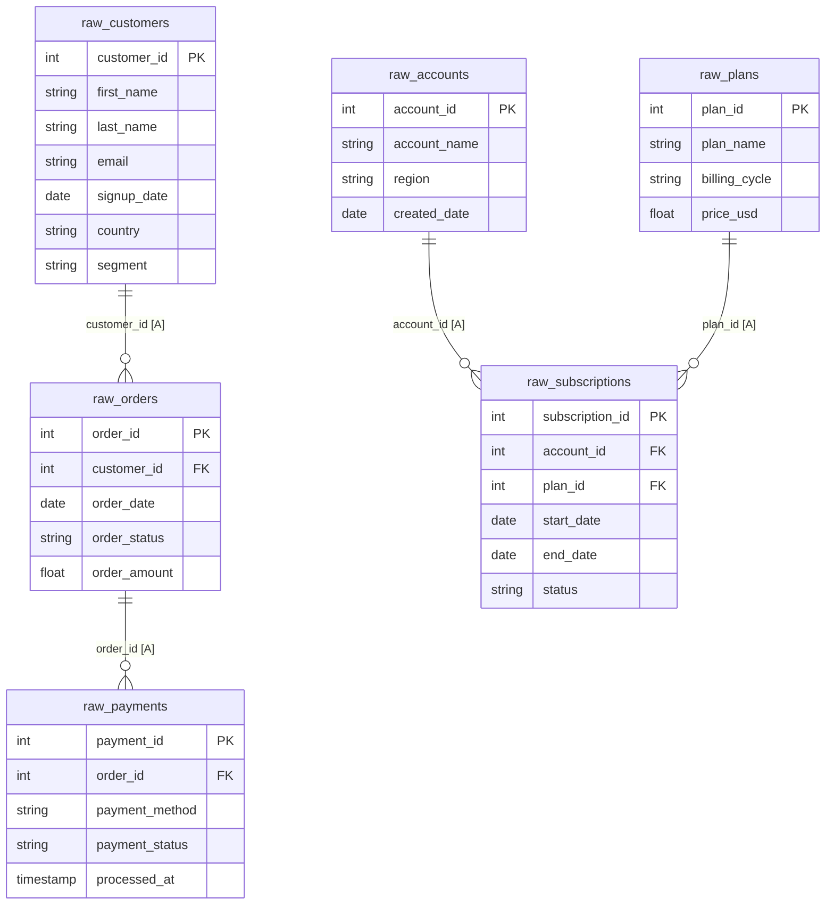
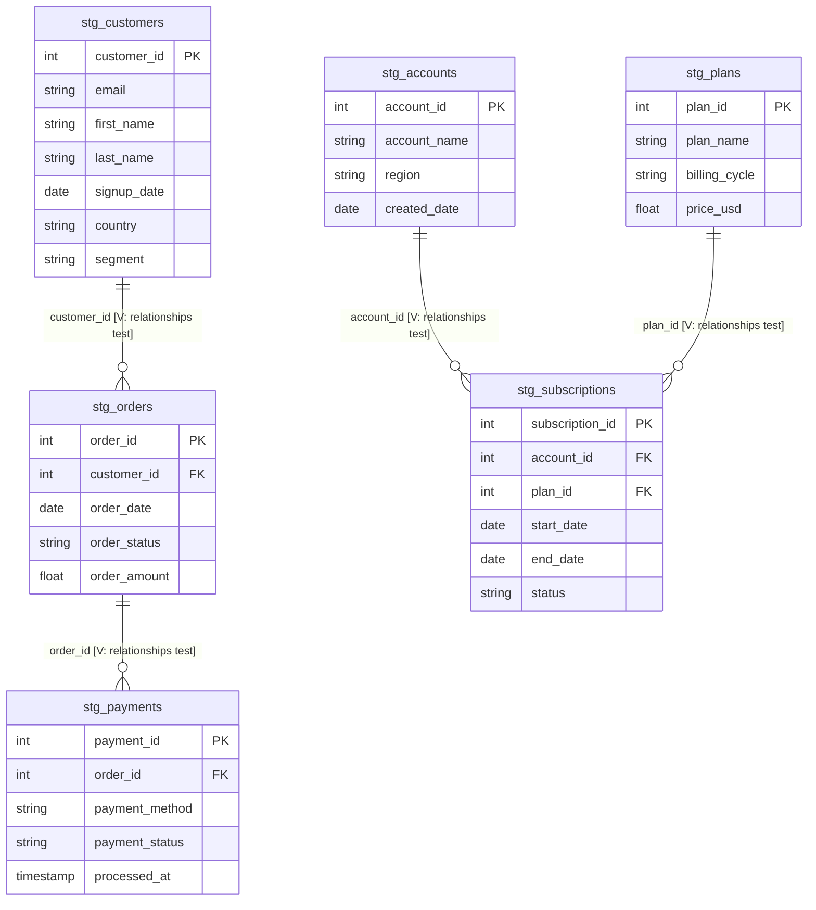
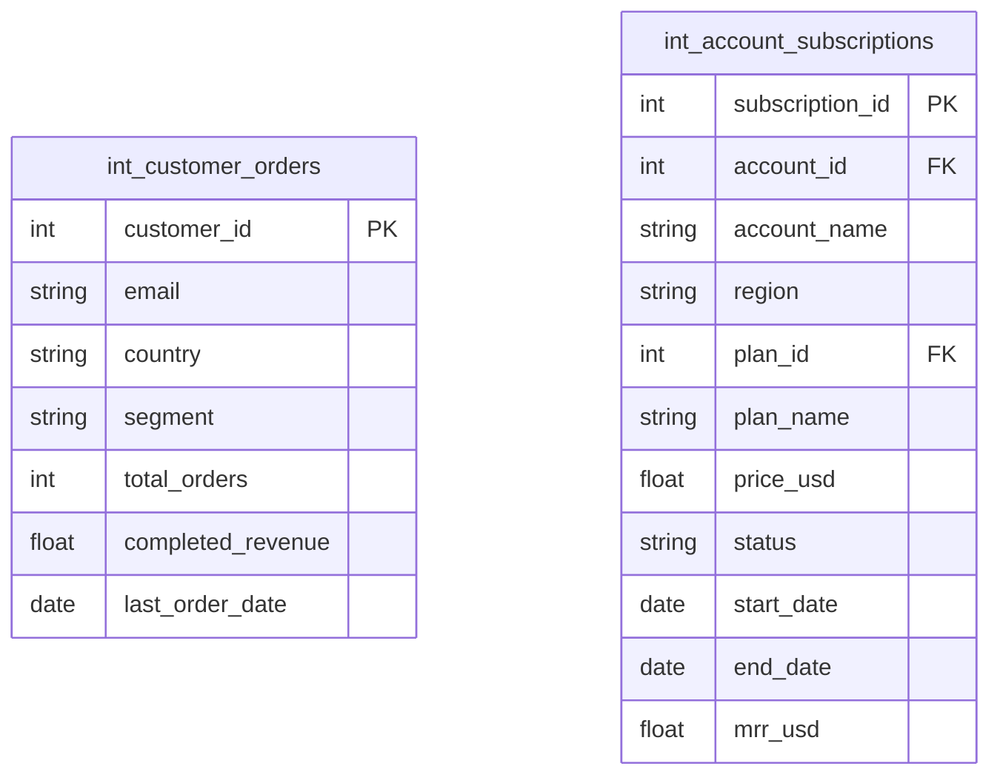
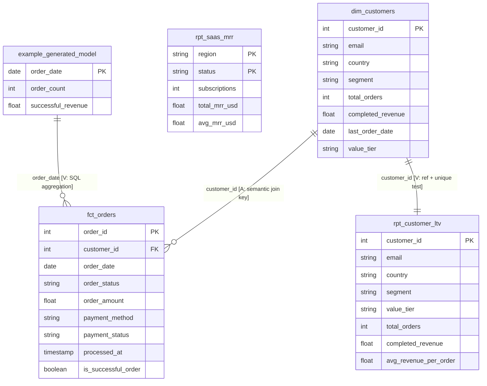
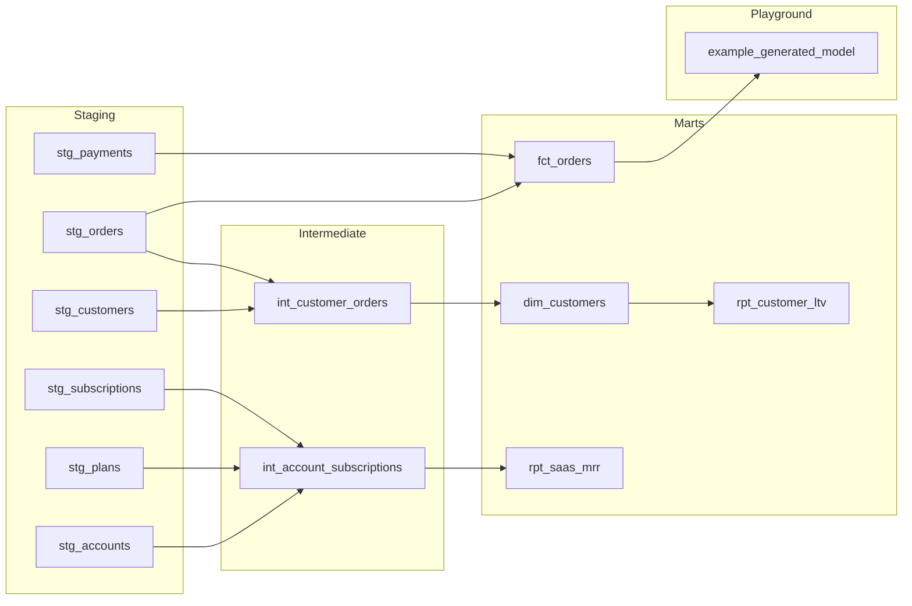
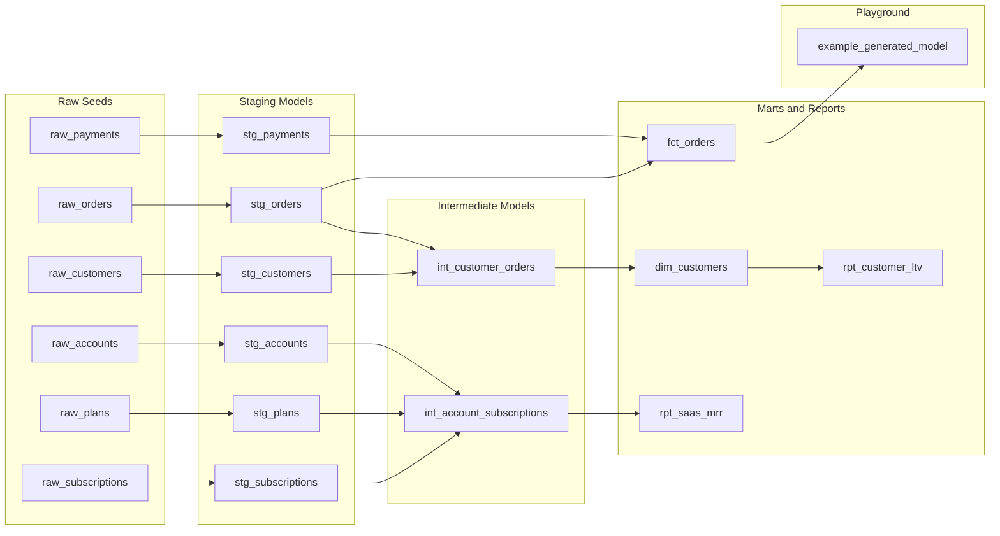

# dbt Model Diagrams

Legend: V = verified from dbt tests and/or SQL join logic. A = assumed business-grain relationship (not enforced by tests/constraints).

### How to Read the ER Diagrams

- Each box is a table/model.
- `PK` means primary key (expected unique row identifier).
- `FK` means foreign key (column used to connect to another table).
- Relationship symbols:
  - `||` = exactly one
  - `o|` = zero or one
  - `|{` = one or many
  - `o{` = zero or many
- Example: `dim_customers ||--o{ fct_orders` means one customer can have zero or many orders.
- Edge labels show the join column (for example, `customer_id`) and whether the relationship is `V` (verified) or `A` (assumed).

## Table Relationships — Layer 1: Raw Seeds

---

## Table Relationships — Layer 2: Staging

---

## Table Relationships — Layer 3: Intermediate

No direct join relationship exists between the two intermediate tables; each is built independently from staging models.

Build hints from docs/SQL:
- int_customer_orders grain is one row per customer_id [V: unique test on customer_id].
- int_account_subscriptions grain is one row per subscription_id [V: unique test on subscription_id].

---

## Table Relationships — Layer 4: Marts & Reports

---

## Model Layer Overview

Shows how models are organised across layers without the raw seeds.

---

## Full Lineage (Seeds → Marts)

End-to-end lineage from raw seed files through every model layer.

